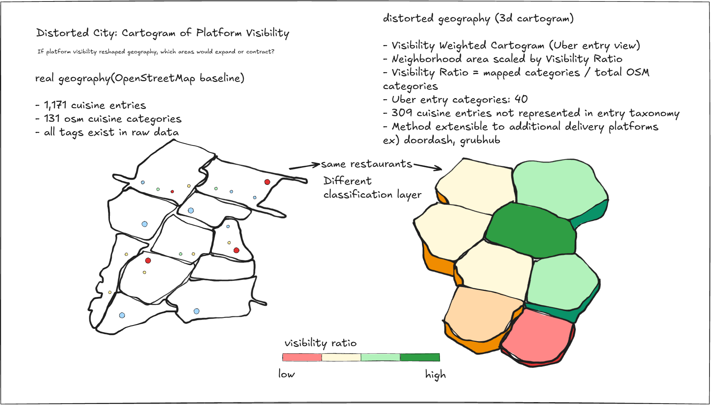
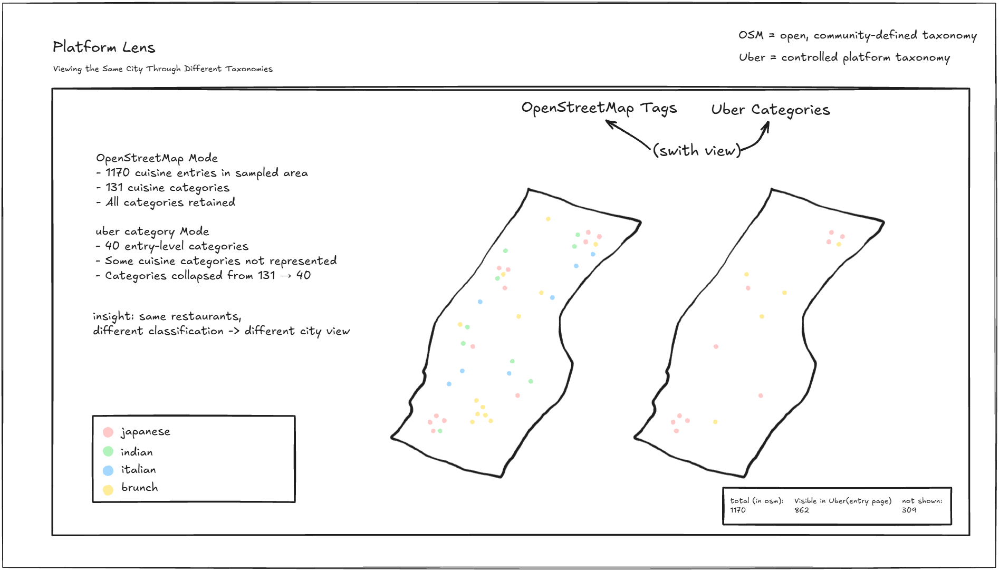
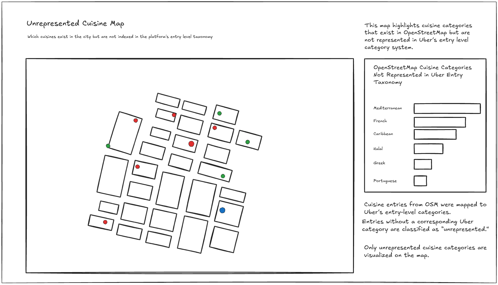
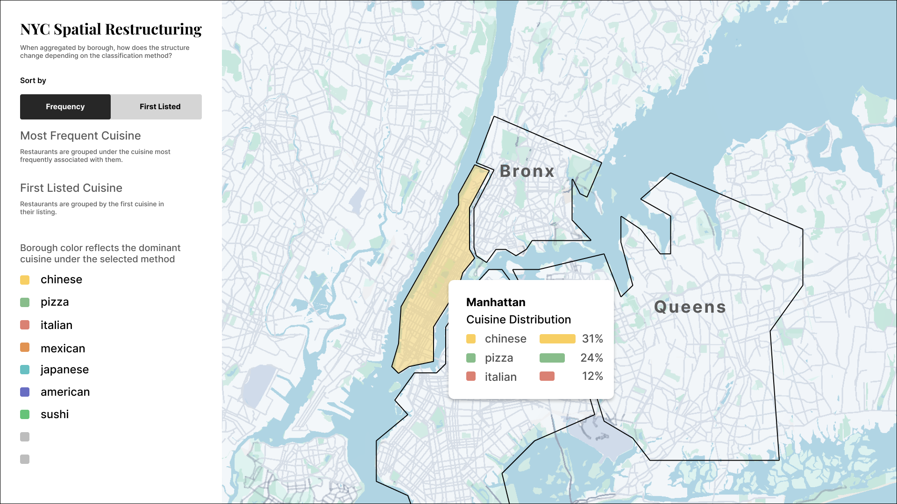
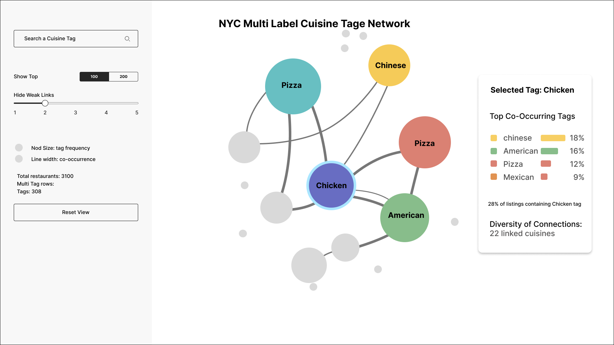

# Literature Review

Alexander, Christopher, Sara Ishikawa, and Murray Silverstein. A pattern language: Towns, buildings, construction. New York, NY: Oxford Univ. Press, 1977. 

CASTELLS, Manuel. The Informational City: Information Technology, economic, restructuring, and the urban-regional process. Oxford, Oxfordshire: Blackwell, 1989.

Kelly-Holmes, Kelly. Advertising as multilingual communication. New York, NY: Palgrave Macmillan, 2005. 

Nasar, Jack L. The evaluative image of the city. Thousand Oaks, CA: Sage Publications, 1998. 

Phillipson, Robert. Linguistic imperialism Robert Phillipson. Oxford, Oxfordshire: Oxford University Press, 1992. 

Portella, Adriana. Visual pollution : advertising, signage and environmental quality. Burlington, Vermont: Ashgate, 2014. 

# 01D Thesis Abstract

This project examines how outdoor dining in New York City changed after the COVID-19 pandemic, with a focus on Manhattan. During the pandemic, emergency policies allowed restaurants to rapidly expand into streets and sidewalks, making outdoor dining a widespread urban condition. However, most of these structures have since been removed.
By comparing pandemic-era permits with current outdoor dining approvals, this study identifies where outdoor dining has persisted and where it has disappeared. The analysis suggests that survival is uneven and tends to concentrate along specific streets rather than being evenly distributed across the city.
To explain this pattern, the project combines spatial data with street-level case studies. A comparative analysis of selected corridors shows that survival does not appear to be determined by sidewalk space alone, but is influenced by how street configuration and regulatory conditions shape where outdoor dining can persist.
These spatial differences may also shape uneven urban experiences. Streets where outdoor dining remains tend to concentrate activity and social interaction, while others experience its absence or removal, leading to different perceptions among residents and businesses.

# 01E Thesis Introduction

During the COVID-19 pandemic, New York City allowed restaurants to build outdoor dining structures on streets and sidewalks. These structures quickly became a defining feature of the city. At its peak, outdoor dining permits exceeded 10,000 across New York City. Today, fewer than 500 remain active.
These structures were not only a response to public health restrictions, but also a survival strategy. By expanding seating capacity, outdoor dining allowed many restaurants to continue operating during a period of economic uncertainty.
However, several years later, the urban landscape has changed significantly. While some outdoor dining structures remain, many have disappeared. The shift is visible across the city: streets that were once filled with dining sheds now have none, while others continue to maintain a strong outdoor dining presence.
This uneven pattern raises an important question:
Why did outdoor dining survive in some places but disappear in others?
This thesis examines outdoor dining in Manhattan as a spatial and urban phenomenon rather than simply a temporary policy. By comparing pandemic-era permits with current approvals, the project maps where outdoor dining remained and where it disappeared.
Beyond mapping, this research explores the conditions that may shape survival. It focuses on how street configuration, regulatory constraints, and urban function interact to determine where outdoor dining can persist. These conditions, in turn, may influence how outdoor dining is experienced across the city.

# 02A Concepts and Sketches

## concept sketches for food taxonomy and platform visibility

three visualization concepts exploring how platform level food classification reshapes spatial and semantic visibility with sample data.

Dataset:
- OpenStreetMap cuisine data (1,171 cuisine entries)
- 131 unique cuisine categories
- Uber entry-level taxonomy (40 categories)

## 1. Distorted Cartogram – Platform Visibility Ratio

This visualization explores how platform visibility reshapes geography.

Question:
If Uber’s entry-level taxonomy determined spatial prominence, which neighborhoods would expand or contract?

Method:
Neighborhood areas are scaled by a Visibility Ratio:

Visibility Ratio = mapped categories / total OSM categories

## 2. Platform Lens – Same City, Different Classification

This visualization compares how the same restaurants appear under different classification systems.

Question:
How does the city change when the taxonomy layer changes?

Method:
- OSM view retains 131 cuisine categories
- Uber entry view collapses categories to 40
- Same restaurant locations, different classification output

## 3. Unrepresented Cuisine Map – What Exists but Is Not Indexed

This map highlights cuisine categories present in OSM but not represented in Uber’s entry-level taxonomy.

Question:
Which cuisines exist in the city but are absent from entry-level platform classification?

Method:
Cuisine entries without a corresponding Uber category are marked as “unrepresented.”
Only these categories are visualized.

# 02B Design Mockup

## 1. NYC Spatial Restructuring

## 2. NYC Multi-Label Cuisine Tag Network

### Osm Tag

