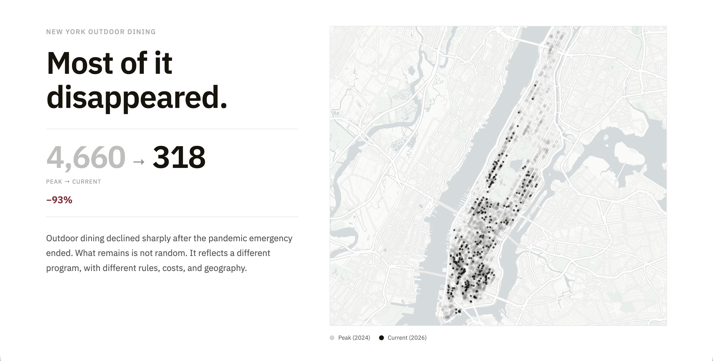

# Where Outdoor Dining Remains
How outdoor dining in NYC became uneven

This repository is part of a thesis project for the Master of Science in Data Visualization at Parsons School of Design, The New School.

→ View Live  
https://hoonkim0123.github.io/thesis/

---

## Preview

---

## Abstract

Outdoor dining once appeared everywhere in New York City. At its peak, thousands of temporary structures filled streets across neighborhoods, reshaping how people experienced the city. Today, far fewer remain. But this project argues that the change is not only about decline.

Outdoor dining did not simply disappear. It became uneven.

This project examines how the transition from an emergency program to a permanent system reshaped where outdoor dining persists. Using spatial analysis and visualization, it reveals that what remains is concentrated along a small number of streets rather than distributed across the city.

By comparing historic and current locations, the project shifts the focus from how much was lost to where it was lost from. It shows how urban systems, regulations, and local conditions influence not only what exists, but what is visible and experienced in everyday life.

In doing so, the project reframes outdoor dining as a spatial phenomenon—one that changes how the city is perceived depending on where you are.

---

## Project Preview

  
  

---

## Data Sources

- NYC Open Data — Open Restaurants (Historic)
- NYC Open Data — Dining Out NYC (Current Locations)
- NYC Department of City Planning — Neighborhood Tabulation Areas
- MTA — Subway Stations Data
- NYC 311 Service Requests (Outdoor Dining Related)

---

## Author

Saehun Kim  
M.S. Data Visualization, Parsons School of Design

---

## Links

Live Project:  
https://hoonkim0123.github.io/thesis/

Full Written Thesis:  
