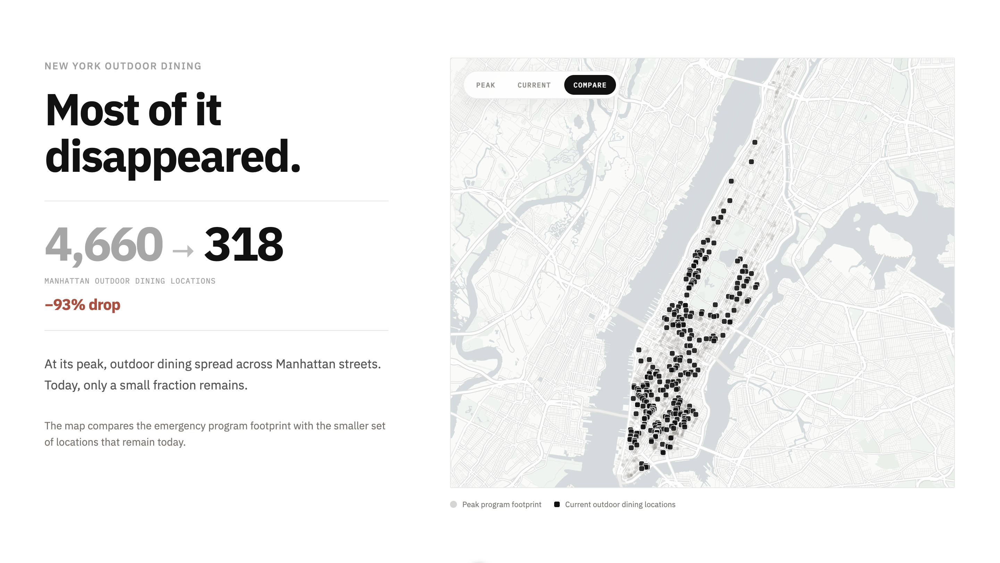
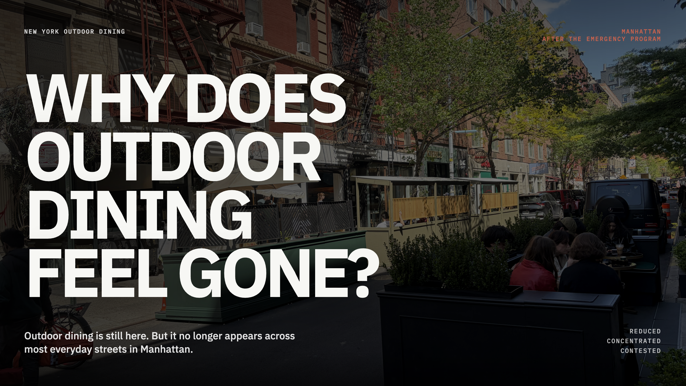
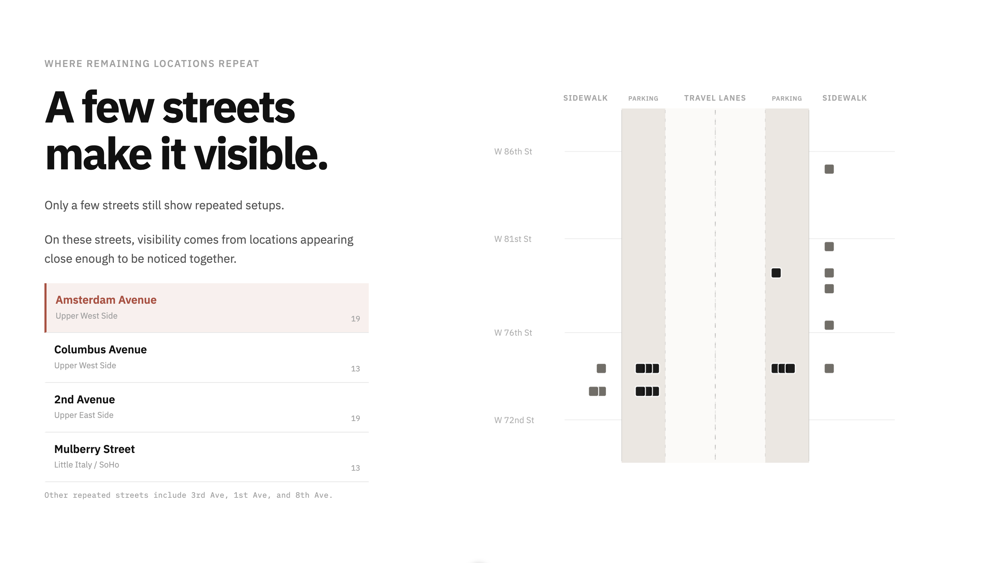
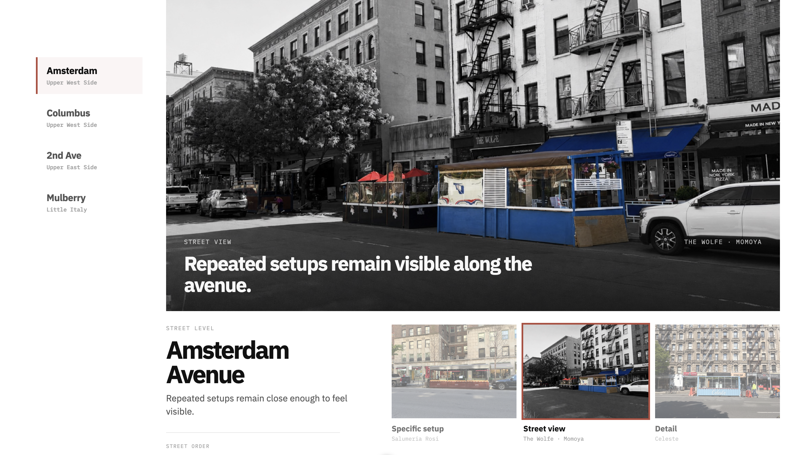

# New York Outdoor Dining
Visibility, Repetition, and Contested Street Space in Manhattan

This repository is part of a thesis project for the Master of Science in Data Visualization at Parsons School of Design, The New School.

→ View Live  
https://hoonkim0123.github.io/thesis/

---

## Preview

---

## Abstract

Outdoor dining once appeared across many everyday streets in Manhattan. During the COVID-19 pandemic, emergency policies allowed restaurants to expand into sidewalks and roadways, making outdoor dining one of the most visible changes to New York City’s street life.

Today, far fewer locations remain. But this project argues that the change is not only about decline.

Outdoor dining did not simply disappear. It was reduced, concentrated, and contested.

Using historic Open Restaurants data, current Dining Out NYC licensed locations, 311 complaints, public comments, and street-level spatial analysis, this project examines how outdoor dining changed from a widespread emergency condition into a smaller permanent program.

The analysis shows that Manhattan outdoor dining declined from 4,660 historic locations to 318 current unique point locations. A 200-foot grid analysis also suggests that only about 10 percent of the former spatial coverage remains.

The project shifts the question from whether outdoor dining still exists to where it remains visible. It shows that remaining locations are concentrated along a smaller set of streets, where repeated nearby setups can still make outdoor dining noticeable. At the same time, 311 complaints and public comments show how outdoor dining became contested shared street space.

In doing so, the project reframes outdoor dining as a spatial condition: still present in Manhattan, but no longer present across most everyday streets.

---

## Project Preview

  
  

---

## Data Sources

NYC Open Data: Open Restaurants Applications Historic  
NYC Open Data: Dining Out NYC Locations  
NYC Open Data: 311 Service Requests from 2020 to Present  
MTA Open Data: Subway Stations  
NYC public process: public comments related to outdoor dining policy  
Derived street labels and spatial analysis datasets

---

## Author

Saehun Kim  
M.S. Data Visualization, Parsons School of Design

---

## Links

Live Project:  
https://hoonkim0123.github.io/thesis/

Full Written Thesis:  
[New York Outdoor Dining Written Thesis](written-thesis/New_York_Outdoor_Dining_Written_Thesis_Saehun_Kim.pdf)